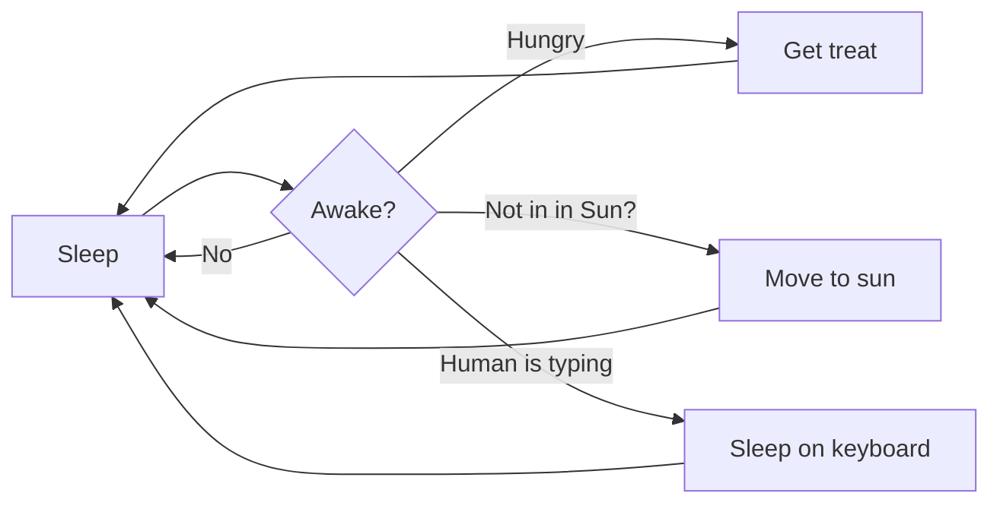
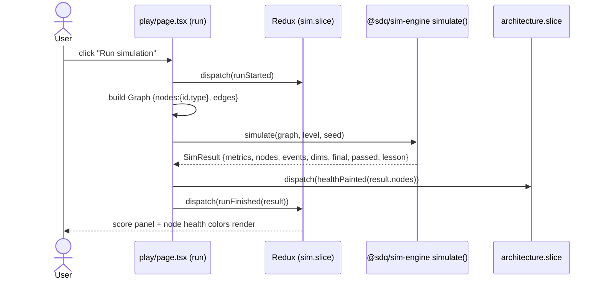
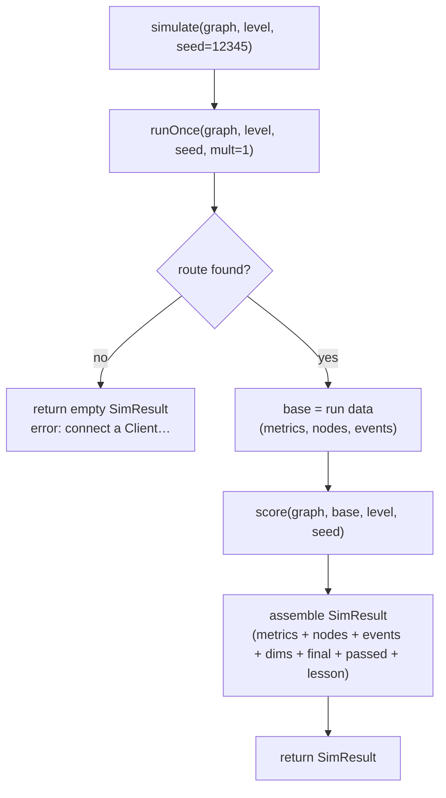
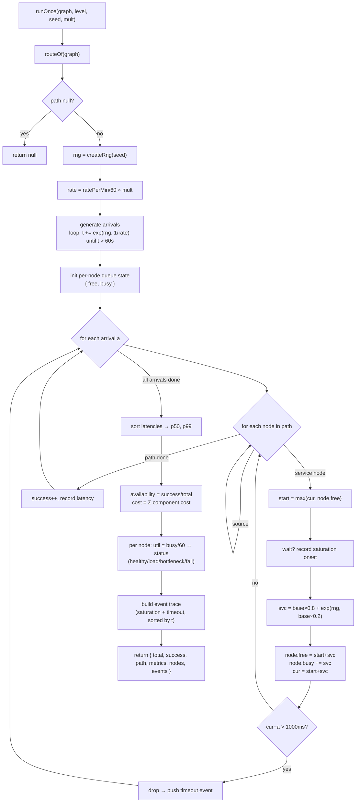
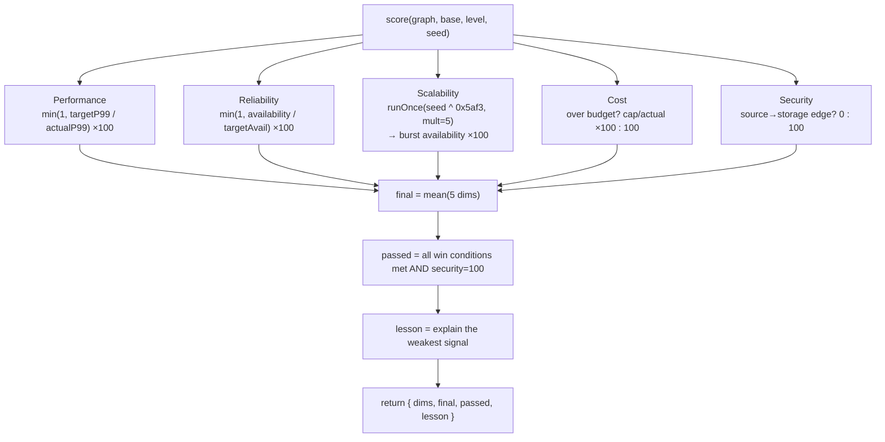
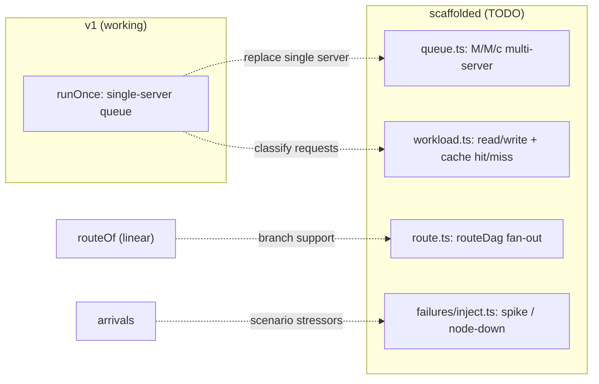

# Engine Flow — how the functions connect & trigger

Visual companion to the README. Diagrams are [Mermaid](https://mermaid.js.org/) —
they render on GitHub and in most markdown viewers (VS Code: "Markdown Preview
Mermaid Support").

---

## 1. Trigger path — from the Run button to a score

What happens when a player clicks **Run** on `/play`. 

> Today `simulate()` runs on the main thread (hence the `PREVIEW ENGINE` tag). The
> next phase moves it into a Web Worker — the trigger path stays identical, only the
> call becomes async `postMessage`.

---

## 2. `simulate()` — orchestration (the public entry point)

---

## 3. `runOnce()` — the simulation itself

This is the coffee-shop model. One deterministic run at a traffic multiplier.

---

## 4. `score()` — outcomes → five dimensions

---

## 5. Function reference

| Function | File | Calls | Returns |
|---|---|---|---|
| `simulate` | `src/index.ts` | `runOnce`, `score` | `SimResult` |
| `runOnce` | `src/simulation/simulate.ts` | `routeOf`, `createRng`, `exp`, `modelOf` | `RunOnce \| null` |
| `routeOf` | `src/simulation/route.ts` | `modelOf` | `GraphNode[] \| null` |
| `score` | `src/scoring/score.ts` | `runOnce` (burst), `modelOf` | `Score` |
| `createRng` / `exp` | `src/rng/mulberry32.ts` | — | `Rng` / `number` |
| `modelOf` | `src/components/models.ts` | — | `ComponentModel \| undefined` |
| `loadLevel` | `src/levels/loader.ts` | `levelSchema.parse` | `Level` |

### Key trigger relationships
- **The UI never calls `runOnce` or `score` directly** — only `simulate()`. That single
  entry point is also what the backend will call to verify scores (one code path).
- **`score()` calls `runOnce()` a second time** for the 5× burst (Scalability). So a
  single `simulate()` runs the engine **twice**: once at 1×, once at 5× — both seeded,
  both deterministic.
- **`routeOf` is the gatekeeper**: no Client or no path → `runOnce` returns null →
  `simulate` returns the empty/error result and nothing else runs.

---

## Where the skeleton (TODO) parts will hook in

